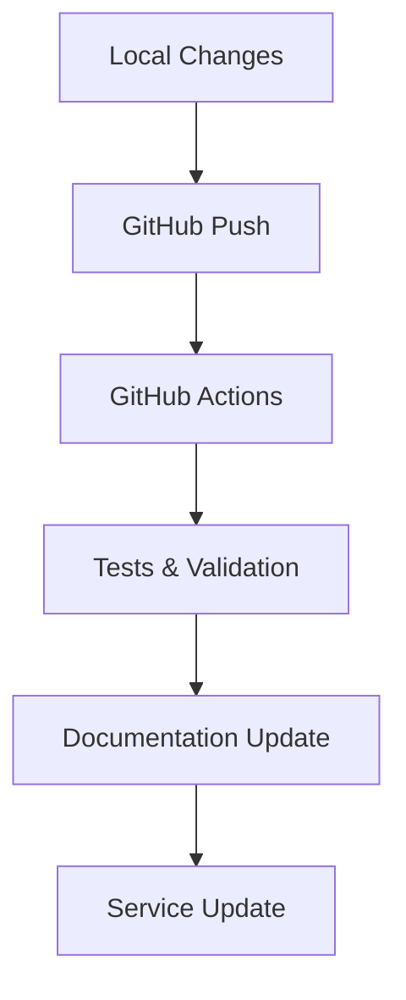

# Hybrid Architecture: Dinesh Assistant AI Agent

## Table of Contents
1. [Overview](#overview)
2. [Project Objectives](#project-objectives)
3. [Layman's Guide](#laymans-guide)
4. [Technical Architecture](#technical-architecture)
5. [Components in Detail](#components-in-detail)
6. [Integration Points](#integration-points)
7. [Permanent Service Architecture](#permanent-service-architecture)
8. [Future Roadmap](#future-roadmap)

## Overview

Dinesh Assistant is a sophisticated AI agent that combines local processing with cloud-based intelligence to provide an always-available, responsive, and intelligent assistant for configuration management and development tasks.

```
                     ┌───────────────────┐
                     │    User Request   │
                     └─────────┬─────────┘
                               ▼
              ┌────────────────────────────────┐
              │     Dinesh Assistant Agent     │
              │   (Local Service + Web UI)     │
              └────────────────┬───────────────┘
                              │
         ┌──────────────────┬─┴───┬──────────────────┐
         ▼                  ▼      ▼                  ▼
┌─────────────┐    ┌────────────┐    ┌─────────────┐    ┌─────────────┐
│    GitHub   │    │Azure OpenAI│    │    MCP      │    │   Local     │
│  Services   │    │  Services  │    │  Server     │    │  Processing │
└─────────────┘    └────────────┘    └─────────────┘    └─────────────┘
```

## Project Objectives

1. **Intelligent Assistance**
   - Provide context-aware development support
   - Automate repetitive tasks
   - Offer natural language interaction

2. **Always Available**
   - Run as a permanent system service
   - Ensure reliability and fault tolerance
   - Automatic recovery from failures

3. **Hybrid Intelligence**
   - Combine local processing with cloud AI
   - Leverage GitHub Copilot's capabilities
   - Integrate with Azure OpenAI services

4. **Development Acceleration**
   - Streamline configuration management
   - Automate documentation
   - Facilitate code review and improvement

## Layman's Guide

### What is Dinesh Assistant?

Think of Dinesh Assistant as your personal tech buddy who's always there to help. Just like how your smartphone's assistant helps with daily tasks, Dinesh Assistant helps with programming and computer tasks. It's like having a knowledgeable friend who:

1. **Never Sleeps**
   - Always ready to help, 24/7
   - Automatically restarts if something goes wrong
   - Keeps track of all conversations

2. **Speaks Your Language**
   - Understands normal English questions
   - Explains technical stuff simply
   - Helps with both basic and complex tasks

3. **Lives in Two Worlds**
   - Works on your computer (for speed and privacy)
   - Connects to the cloud (for smart answers)
   - Uses GitHub (like a smart backup system)

4. **Has Multiple Skills**
   - Helps write and fix code
   - Organizes your project files
   - Keeps track of changes
   - Creates documentation

### How Does It Work?

```
User: "Help me fix this code"
     │
     ▼
┌──────────────┐
│  Web Browser │ ◄──── You can talk to it through a website
└──────┬───────┘
       │
       ▼
┌──────────────┐
│   Assistant  │ ◄──── Lives on your computer
└──────┬───────┘
       │
       ▼
┌──────────────┐
│  Smart Brain │ ◄──── Uses cloud AI to think and help
└──────┬───────┘
       │
       ▼
┌──────────────┐
│    GitHub    │ ◄──── Saves and organizes everything
└──────────────┘
```

## Technical Architecture

### Core Components

1. **Frontend Layer**
   ```
   ┌─────────────────────────────────────┐
   │           Web Interface             │
   ├─────────────────────────────────────┤
   │ - FastAPI UI                        │
   │ - WebSocket Real-time Communication │
   │ - Responsive Design                 │
   └─────────────────────────────────────┘
   ```

2. **Backend Service**
   ```
   ┌─────────────────────────────────────┐
   │         Permanent Service           │
   ├─────────────────────────────────────┤
   │ - LaunchAgent Integration          │
   │ - Process Management               │
   │ - Error Recovery                   │
   └─────────────────────────────────────┘
   ```

3. **AI Integration Layer**
   ```
   ┌─────────────────────────────────────┐
   │         Hybrid Intelligence         │
   ├─────────────────────────────────────┤
   │ - GitHub Copilot Integration       │
   │ - Azure OpenAI Services            │
   │ - Local Processing Pipeline        │
   └─────────────────────────────────────┘
   ```

### Language Models and Training

1. **Primary LLM**
   - Based on GitHub Copilot's underlying model
   - Fine-tuned for development tasks
   - Contextually aware of project structure

2. **Local Processing**
   - Pattern recognition for quick responses
   - Caching of common queries
   - Project-specific knowledge base

## Components in Detail

### 1. Model Context Protocol (MCP) Server

The MCP server acts as a bridge between different components:

```
┌─────────────────┐      ┌─────────────────┐
│  Local Agent    │ ──── │   MCP Server    │
└─────────────────┘      └────────┬────────┘
                                  │
                  ┌───────────────┴───────────────┐
                  ▼               ▼               ▼
           ┌──────────┐   ┌──────────┐   ┌──────────┐
           │  GitHub  │   │  Azure   │   │  Local   │
           │   API    │   │   API    │   │   API    │
           └──────────┘   └──────────┘   └──────────┘
```

Key Features:
- Protocol standardization
- Request routing
- Response aggregation
- Error handling
- Rate limiting

### 2. CI/CD Pipeline Integration



Components:
1. **Local Development**
   - Code changes
   - Documentation updates
   - Configuration modifications

2. **GitHub Integration**
   - Automated commits
   - Pull request management
   - Version control

3. **Continuous Integration**
   - Automated testing
   - Code quality checks
   - Build validation

4. **Continuous Deployment**
   - Automatic service updates
   - Rolling restarts
   - Health monitoring

### 3. Frontend Architecture

```
┌─────────────────────────────────────────────┐
│                Web Interface                │
├─────────────────────────────────────────────┤
│ ┌─────────────┐ ┌─────────────┐            │
│ │  Chat UI    │ │  Code View  │            │
│ └─────────────┘ └─────────────┘            │
│ ┌─────────────┐ ┌─────────────┐            │
│ │ File Browser│ │  Settings   │            │
│ └─────────────┘ └─────────────┘            │
└─────────────────────────────────────────────┘
```

Features:
- Real-time chat interface
- Code highlighting
- File system navigation
- Configuration management
- Response visualization

### 4. Backend Architecture

```python
class BackendArchitecture:
    """
    Core backend components and their relationships
    """
    def __init__(self):
        self.components = {
            'web_server': FastAPI(),
            'ai_engine': AIProcessor(),
            'file_manager': FileSystem(),
            'github_client': GitHubIntegration(),
            'mcp_client': MCPClient()
        }
```

Key Services:
1. **Web Server**
   - Route handling
   - WebSocket management
   - Request validation
   - Response formatting

2. **AI Engine**
   - Context management
   - Query processing
   - Response generation
   - Learning pipeline

3. **File System**
   - Project structure
   - File operations
   - Cache management
   - Temporary storage

## Integration Points

### 1. GitHub Integration

The assistant leverages GitHub for:
- Version control
- Code storage
- Collaboration
- Issue tracking
- Documentation hosting
- CI/CD pipeline

### 2. Azure OpenAI Integration

Connects with Azure services for:
- Advanced language processing
- Code analysis
- Pattern recognition
- Learning capabilities
- Scalability

### 3. Local Processing

Handles on-device tasks for:
- Quick responses
- File operations
- Cache management
- System commands

## Permanent Service Architecture

### LaunchAgent-based Deployment

```xml
<?xml version="1.0" encoding="UTF-8"?>
<!DOCTYPE plist PUBLIC "-//Apple//DTD PLIST 1.0//EN">
<plist version="1.0">
<dict>
    <key>Label</key>
    <string>com.dinesh.assistant</string>
    <key>ProgramArguments</key>
    <array>
        <string>/bin/bash</string>
        <string>start_server.sh</string>
    </array>
    <key>RunAtLoad</key>
    <true/>
    <key>KeepAlive</key>
    <true/>
</dict>
</plist>
```

Features:
1. **Automatic Startup**
   - System boot initialization
   - User login activation
   - Environment setup

2. **Process Management**
   - Health monitoring
   - Auto-restart on failure
   - Resource management

3. **Logging System**
   - Error tracking
   - Performance monitoring
   - Debug information

## Future Roadmap

1. **Enhanced AI Capabilities**
   - Custom model training
   - Improved context understanding
   - Specialized domain knowledge

2. **Extended Integrations**
   - Additional cloud services
   - More development tools
   - Enhanced automation

3. **Performance Optimizations**
   - Faster response times
   - Reduced resource usage
   - Better caching

4. **User Experience**
   - Enhanced UI/UX
   - Mobile interface
   - Voice interaction

## Summary

Dinesh Assistant represents a new generation of AI-powered development tools that combine:
- Local processing power
- Cloud-based intelligence
- Permanent availability
- Robust error handling
- Comprehensive integration
- User-friendly interface

Its hybrid architecture ensures:
- Fast response times
- High availability
- Secure operations
- Scalable processing
- Continuous learning

Whether you're a developer seeking coding assistance or a system administrator managing configurations, Dinesh Assistant provides an intelligent, reliable, and always-available helping hand in your development journey.